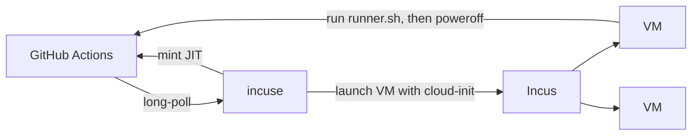

[](LICENSE)

# incuse

Ephemeral GitHub Actions runners on [Incus](https://linuxcontainers.org/incus/)
VMs.

## What

A single-host orchestrator that long-polls a GitHub Actions Runner Scale Set,
mints a JIT runner config for each assigned job, and launches a fresh Incus VM
to run it. The VM powers itself off when the runner exits; an idle reaper
cleans up stragglers.



Designed to run as a `systemd` service on the same host as the Incus daemon,
talking to it over the local Unix socket. HTTPS+cert is also supported for
off-host deployments.

## Status

Early. See the project plan for the active phase.

## Install

On a host running Incus, with the `incuse` system user pre-created (or letting `install.sh` create it):

```bash
bash deploy/systemd/install.sh ./bin/incuse
# edit /etc/incuse/config.yaml, drop a chmod-600 PAT at /etc/incuse/github.pat
systemctl enable --now incuse
```

Full walkthrough: [`docs/deployment.md`](docs/deployment.md). Day-2 ops: [`docs/operations.md`](docs/operations.md).

## Build

```bash
make            # build ./bin/incuse
make test       # go test -race ./...
make lint       # golangci-lint run
```

## License

MIT — see [LICENSE](LICENSE).
